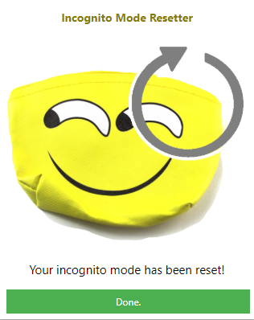

# Incognito Mode Resetter

This extension deletes all the history, cookies, and cache of a running incognito session in Chrome while eliminating the necessity to close the entire session, much less any tabs at all!

To use, first download and save the files locally on your computer. Next, go to [chrome's extension page](chrome://extensions) and enable *Developer Mode*. Click on **Load unpacked** at the top of the page and then navigate to the folder containing the source to install it. Since this extension is designed to runin incognito mode, you will need to enable it in incognito mode by clicking on *Details* (once the extension is loaded, this button will be displayed), then toggle on **Allow in incognito**. 

Happy browsing!

### Are Developer Mode Extensions Harmful?

> "If you installed a Chrome extension from a reliable source, then you do not need to be concerned. On the other hand, if Chrome has suddenly started displaying Developer Mode notifications then you should be concerned. This is because developer mode extensions can include features that are not normally allowed in extensions listed in the Chrome Web Store. This include local executables and behavior that is frowned up. This behavior could include injecting advertisements, displaying popups, or tracking what sites you visit."

> Source: [Bleeping Computer](https://www.bleepingcomputer.com/virus-removal/remove-and-disable-chrome-developer-mode-extensions "How to Disable and Remove Developer Mode Extensions in Chrome")
